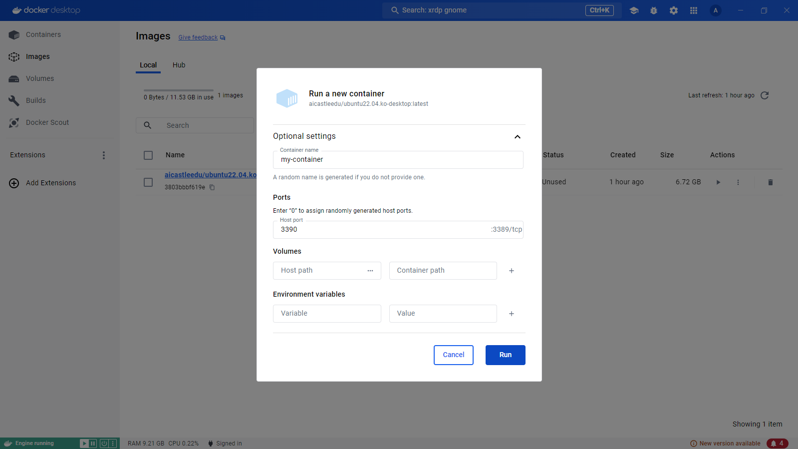

# Docker 데스크탑 GUI 사용법

## [1] 도커 데스크탑 실행 및 로그인
1. 도커 데스크탑 실행  

    

2. 로그인 (공개 계정)

    - 터미널에 아래 명령어를 실행  
        ```shell
        docker login -u aicastleedu -p dckr_pat_8-t6YhrqbCZwOzHLe8e7Tj51mDg
        ```

    - `Login Succeeded` 가 나오면 정상적으로 로그인 된 것입니다.  

    - 우측 상단 계정 표시에 `aicastleedu`가 나오는지 확인  
    

## [2] docker pull
- 좌측 Images 메뉴를 클릭 > Hub 탭 클릭  

- 원하는 이미지와 태그 위에 마우스를 올리고 `Pull` 실행  
    (예 : `aicastleedu/ubuntu22.04.ko-desktop:latest`)
    

- 이미지가 다운로드 완료되면 Images 에서 확인 가능합니다.  

## [3] docker run

- 컨테이너로 실행하고자 하는 이미지 위에 마우스를 올리고 `Run` 실행  

    

- 컨테이너 이름을 입력하고 Port를 `3390`를 입력하고 실행  

    

- 정상적으로 컨테이너가 실행 된 화면  

    

- 좌측의 Containers 메뉴에서 실행된 컨테이너 목록을 확인 가능  

    

## [4] RDP(원격 데스크톱) 클라이언트로 컨테이너에 접속
### (1) Windows
- 원격 데스크톱 실행  

    

- `localhost:3390`으로 연결  

    

- 유저 정보 입력 후 로그인  
    - username : `user`
    - password : `1234`

    

- 원격 접속된 화면  

    

### (2) Mac
- `Mac App Store` 열기
- `Microsoft Remote Desktop` 검색 및 설치
- `Microsoft Remote Desktop` 실행
- 새 연결 (+) 추가
    - PC Name : `localhost:3390`
- 설정이 완료되면, 생성된 연결을 더블 클릭
- 유저 정보 입력 후 로그인  
    - username : `user`
    - password : `1234`

### (3) Ubuntu
- Remmina 설치 
    ```bash
    sudo apt install -y remmina
    ```
- Remmina를 실행하고 새 RDP 연결 추가
- Server에 `localhost:3390` 입력
- 유저 정보 입력 후 로그인  
    - username : `user`
    - password : `1234`


## [5] 컨테이너 중지 및 삭제
- 도커 데스크탑에서 Containers 메뉴 클릭
- Stop 버튼 클릭하여 컨테이너 중지
    
- Delete 버튼 클릭하여 컨테이너 삭제
    

## [6] 이미지 삭제
- 도커 데스크탑에서 Images 메뉴 클릭
- 삭제하고자 하는 이미지의 Delete 버튼 클릭
    